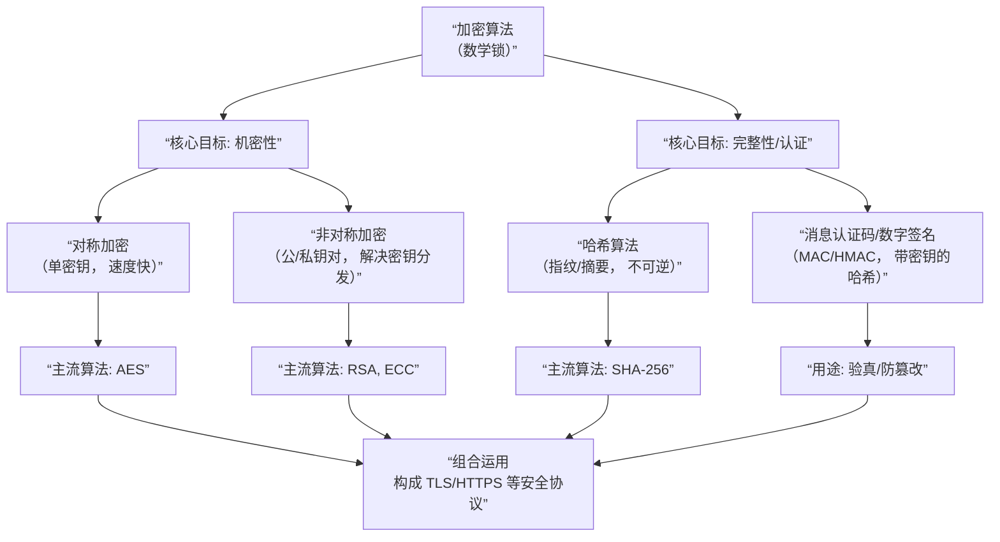

好的，我们脱离教科书，用最直白的工程语言解释。**加密算法就是一个“数学锁”**。你的明文（比如`hello`）是宝贝，放进一个带数学锁的箱子，变成乱码（比如`k3j#1`），这就是密文。只有有正确钥匙的人才能打开箱子还原。

下面这张图概括了现代加密的核心框架和主流算法：



上图展示了加密体系的四大支柱。接下来，我们用快递的比喻，解释上图中最关键的两个加密过程是如何协同工作的。

### 🔐 核心一：对称加密（私密聊天）
**场景**：你和朋友想用一套**只有你俩知道的暗语**通信。
- **钥匙**：**同一把钥匙**（`shared_key`），既用于加密（锁箱），也用于解密（开箱）。
- **过程**：`明文 + 共享密钥 + 加密算法 (如AES) = 密文`
- **特点**：**速度快**，适合加密大量数据（如HTTPS传输的网页内容）。
- **致命问题**：**钥匙怎么安全地交给对方？** 如果网上传输密钥，可能被截获。这就是“密钥分发”难题。

### 🔑 核心二：非对称加密（安全寄信）
**场景**：你想给马云寄一封密信，但无法当面交钥匙。
- **钥匙**：**一对钥匙**（公钥`public_key`和私钥`private_key`），数学关联但无法互推。
    - **公钥**：公开的锁。可以发给任何人。
    - **私钥**：私有的钥匙。自己严格保密。
- **过程**：
    1.  **加密**：任何人用**你的公钥**加密信息，只有**你的私钥**能解密。这保证了**机密性**（别人寄给你的密信，只有你能看）。
    2.  **签名**：你用**你的私钥**对信息签名，任何人用**你的公钥**都能验证签名是否来自你。这保证了**身份认证和完整性**（你发出的信，别人能确认是你写的且没被篡改）。
- **特点**：**解决了密钥分发问题**，但**速度慢**，通常只用于加密小数据（如加密一个“对称加密的密钥”）。

### 🤝 两者如何组合（HTTPS的基石）
现代加密（如HTTPS）的智慧在于**组合使用**，取长补短。以下是你访问 `https://www.example.com` 时，密钥交换与通信的简化过程：

1.  **安全握手（用非对称加密解决对称密钥的配送）**：
    - 浏览器说：“你好，我要用TLS 1.3，这是我的随机数`Client Random`。”
    - 网站说：“好的，这是我的证书（内含**网站的公钥**），还有我的随机数`Server Random`。”
    - 浏览器验证证书真实后，生成一个**预备主密钥**，用**网站的公钥**加密后发送。
    - **只有拥有对应私钥的网站**才能解密，得到预备主密钥。
    - 双方根据两个随机数和预备主密钥，**独立计算出相同的“会话密钥”**。**此密钥从未在网络上明文传输过**。

2.  **高效通信（用对称加密保护数据）**：
    - 此后，双方都用这个**会话密钥**进行**对称加密**（如AES），保护所有HTTP数据。
    - 因为对称加密速度快，所以网页加载流畅。

**简单说**：**非对称加密像邮局的加密信封，用于安全地“邮寄”一把对称加密的钥匙；对称加密像有了钥匙后的专用保险柜，用于后续所有高效、保密的对话。**

### 📝 另外两个关键支柱
为了体系的完整，上图中的另外两个支柱也至关重要：

- **哈希算法**：像是文件的“指纹提取器”（如SHA-256）。它把任意长度的数据（一部电影或一个字母）变成**固定长度**的唯一哈希值（如`a1b2...`）。关键特性是**单向不可逆**（无法从哈希值反推原文）且**雪崩效应**（原文改一点，哈希值天差地别）。用于验证文件完整性、密码存储（只存哈希，不存明文密码）。
- **消息认证码/数字签名**：像是“带密码的指纹”。它结合了**哈希和密钥**，确保消息不仅完整，而且来自声称的发送方。数字签名是非对称加密的典型应用：用**私钥**对信息的哈希值签名，对方用**公钥**验证。

### 💻 程序员视角：加密在代码中是什么样？
```python
# 伪代码示例，展示逻辑，并非直接运行
import magic_crypto_lib

# 1. 非对称加密：生成密钥对
public_key, private_key = generate_rsa_key_pair()

# 2. 用对方的公钥加密一个消息（比如要分享的对称密钥）
encrypted_message = encrypt_with_rsa("这是我的秘密", public_key)

# 3. 只有对方的私钥能解密
decrypted_message = decrypt_with_rsa(encrypted_message, private_key) # 得到 "这是我的秘密"

# 4. 双方现在有了共享秘密，可以切换为更快的对称加密（如AES）
session_key = "our_shared_secret_key_123"
cipher_text = encrypt_with_aes("Hello World!", session_key)
plain_text = decrypt_with_aes(cipher_text, session_key) # 得到 "Hello World!"
```

### 🎯 对你的意义
理解这些，你就能看懂HTTPS握手包、明白为什么抓包看到的是乱码、以及为什么不能随意解密。当你未来设计需要安全通信的分布式存储系统时（比如节点间认证、数据传输加密），这些概念就是你的工具箱。

如果想更深入，可以去看看**RSA算法**的数学原理（基于大数质因数分解的困难性），或者**椭圆曲线加密（ECC）**（更短的密钥实现同等安全，是现在的趋势）。这就是加密算法作为“数学锁”的核心。